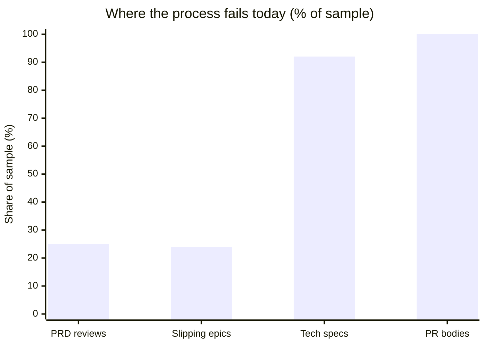
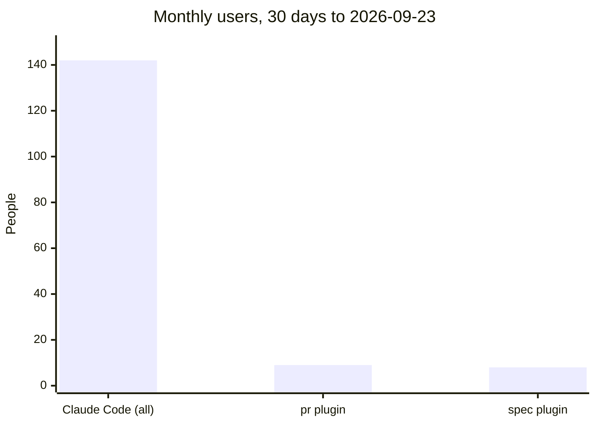
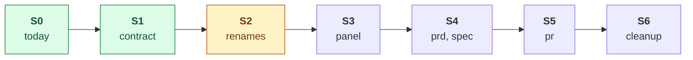
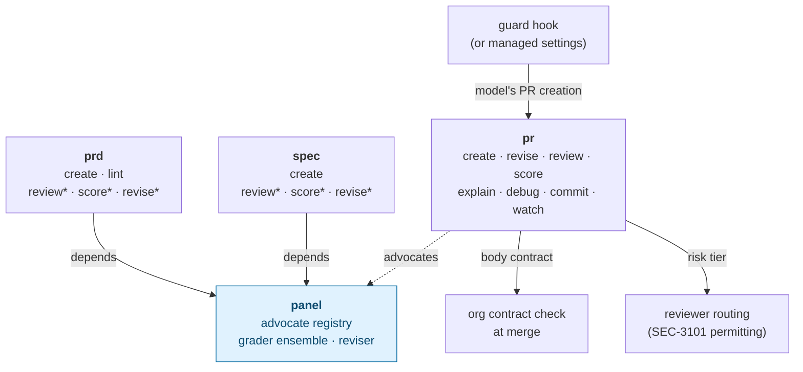
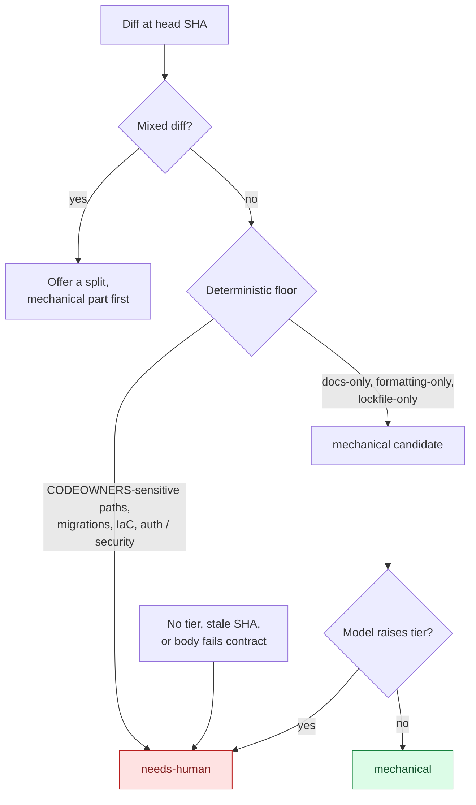
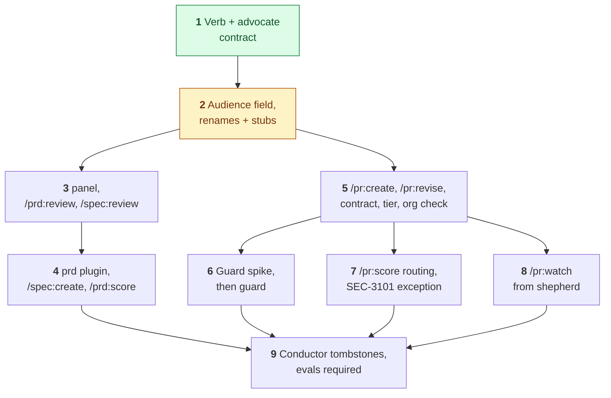

Writing code got faster. The work around it did not. This spec covers **how** we attack the three places in Development's flow that still wait on people (PRDs, tech specs and pull requests) with skills, and how **Rings** gets those skills onto the right laptops.

<CardGroup cols={3}>
  <Card title="The problem" icon="hourglass-half" href="#problem">
    PRDs fail in the review meeting, specs settle late, and reviewers rebuild intent from diffs. The skills that exist reach 9 of 142 Claude Code users.
  </Card>

  <Card title="The fix" icon="layer-group" href="#summary-one-verb-contract-three-nouns-one-engine">
    One verb set (`create`, `review`, `score`, `revise`) on three nouns (`prd`, `spec`, `pr`), backed by one shared engine, `panel`.
  </Card>

  <Card title="The delivery" icon="bullseye" href="#rings-how-the-skills-reach-people">
    Rings labels every plugin with its audience. These four plugins ship to ring 1, **Development**: Engineering, Product and Data Science.
  </Card>
</CardGroup>

## At a glance

|  |  |
| --- | --- |
| **Team** | Platform ([AI Foundry](https://github.com/orgs/tatari-tv/teams/ai-foundry)) |
| **Spec type** | Standalone. No PRD exists, so [Problem](#problem) carries the WHY and [Summary](#summary-one-verb-contract-three-nouns-one-engine), [Goals](#goals) and [Non-goals](#non-goals) carry the WHAT. |
| **Status** | Draft for AI Foundry review. Revised 2026-10-09: "persona" becomes "advocate" throughout (see [Glossary](#glossary)). CONTRIBUTING and the AIF tickets still say "persona" until a follow-up PR and ticket edit land. |
| **Live rename status** | [Skill Renames: What Changed and What To Do](https://marquee.internal.tatari.dev/p/~scott-idler/skill-renames-what-changed-and-what-to-do/) |
| **Design doc** | [Map the Rings, Bottlenecks and Telemetry Work Onto AIF Epics](https://marquee.internal.tatari.dev/p/~scott-idler/aif-epic-restructure-rings-bottlenecks-and-telemetry/) (per-ticket plan and tracking) |
| **Sources** | [Attacking our three bottlenecks (deck)](https://marquee.internal.tatari.dev/p/~scott-idler/prs-prds-and-specs/) · [Rings for tatari-skills](https://marquee.internal.tatari.dev/p/~scott-idler/rings-for-tatari-skills/) · [`/pr:create` design](https://marquee.internal.tatari.dev/p/~scott-idler/pr-create-skill-hook-and-fleet-delivery/) |
| **Related** | [Tech Spec: Claude Code Telemetry](https://marquee.internal.tatari.dev/p/~scott-idler/tech-spec-claude-code-telemetry/) (how we measure whether this worked) |
| **Jira epics** | [AIF-76](https://tatari.atlassian.net/browse/AIF-76) Restructure tatari-skills Around Audience · [AIF-95](https://tatari.atlassian.net/browse/AIF-95) Attack the PRD, Spec and PR Bottlenecks With Skills |
| **Approvers** | [@tatari-tv/ai-foundry](https://github.com/orgs/tatari-tv/teams/ai-foundry) · Security for the PR guard and risk routing (SEC ticket not filed yet) |

---

## Problem

<Info>
  **Three places in Development's flow wait on people, and none has a skill built for it.** Underneath all three, the skill catalog cannot deliver a skill to the people who need it. Source: [Attacking our three bottlenecks](https://marquee.internal.tatari.dev/p/~scott-idler/prs-prds-and-specs/).
</Info>

### The problem in four numbers

Each bar is the share of a measured sample where the process failed the reader. Sources are in the tabs below.

| Bar | What failed | Count |
| --- | --- | --- |
| PRD reviews | reviewers got under 48 hours to read | 5 of 20 |
| Slipping epics | cause named as the spec or requirements | 6 of 25 |
| Tech specs | no recorded approver | 231 of 251 |
| PR bodies | Claude-attributed bodies missing at least one of five reviewer sections | 634 of 634 |



<Tabs>
  <Tab title="1. PRDs" icon="file-lines">
    **PRDs are not ready when they reach review.**

    - **5 of 20** most recent PRD reviews gave reviewers less than 48 hours to read ([PRD Review Lead-Time Audit](https://tatari.atlassian.net/wiki/spaces/TPM1/pages/2694119437/PRD+Review+Lead-Time+Audit+Sep+18+2026), Jul 30 to Sep 18 2026).
    - **5 of 7** H1 2026 design retros: _"When we bypass design and go straight to PRD review, a lot of issues get aired too late."_ ([Design Retro Recurring Themes 2025–2026](https://tatari.atlassian.net/wiki/spaces/PD/pages/2714206349/Design+Retro+Recurring+Themes+2025+2026))
    - **Cause:** gaps surface in the review meeting, not before it. Nothing grades a PRD's readiness before invites go out.
  </Tab>
  <Tab title="2. Specs" icon="compass-drafting">
    **The how gets settled late, and approval is invisible.**

    - **6 of 25** slipping roadmap epics name the spec or requirements as the cause ([SoS Pre-Meeting Summary, 2026-09-04](https://tatari.atlassian.net/wiki/spaces/TPM1/pages/2671476841/SoS+Pre-Meeting+Summary+Sep+4+2026); causes LLM-inferred, one week).
    - **20 of 251** tech specs record who approved them ([Tech Specs: What Changed](https://marquee.internal.tatari.dev/p/eng/tech-specs-what-changed/), 2026-09-10).
    - `tech-spec-review` exists, but nothing drafts a spec from its PRD, and its 8-criterion rubric sits under a name that stutters (`spec:tech-spec-review`).
  </Tab>
  <Tab title="3. PRs" icon="code-pull-request">
    **Code waits on a reviewer.**

    - At least **1 in 4** merges is agent-authored in **9 of our 10** busiest repos ([SRE-4297](https://tatari.atlassian.net/browse/SRE-4297) and the [diagnosis post](https://marquee.internal.tatari.dev/p/sre/pr-review-bottleneck-2026-09-29/), Jul to Sep 2026; marker-based, so a floor).
    - **0 of 634** Claude-attributed PR bodies in September carried all five sections a reviewer needs (measured 2026-09-30, [`/pr:create` design](https://marquee.internal.tatari.dev/p/~scott-idler/pr-create-skill-hook-and-fleet-delivery/)). Reviewers rebuild the why from the diff.
    - Big PRs wait; approved PRs sit. Every PR waits on a human: [SEC-3101](https://tatari.atlassian.net/browse/SEC-3101) requires one human approval on every default branch, whatever the risk.
  </Tab>
  <Tab title="Underneath: delivery" icon="truck">
    **The catalog cannot deliver a skill to the people who need it.**

    - tatari-skills has **29** catalog entries and no enforced answer to "who is this for" ([Rings §01](https://marquee.internal.tatari.dev/p/~scott-idler/rings-for-tatari-skills/)).
    - The early PRD and spec skills (`create-prd`, `tech-plan`, `skeptical-prd-reviewer`, `spec-review`) live in [conductor](https://github.com/tatari-tv/conductor)'s flat namespace beside 57 others, and conductor has been dormant since 2026-07-14 (Rings §03, §05).
    - Skill names are verb-noun compounds in grab-bag plugins (`create-prd`, `tech-spec-review`, `review-pr`), so the same action has a different name on each artifact.
    - Usage: the skills that exist reach a handful of people (chart below).
  </Tab>
</Tabs>

### Who the existing skills reach



`pr` had 9 users and 251 invocations; `spec` had 8 users and 30 invocations. 142 people used Claude Code that month ([telemetry PRD](https://marquee.internal.tatari.dev/p/~scott-idler/prd-claude-code-telemetry/)).

<Warning>
  **Cost of doing nothing.** PRDs keep failing in the meeting, specs keep settling late, and reviewers keep reconstructing intent from diffs. The skills that exist stay installed by a handful of people.
</Warning>

<Tip>
  **The WHAT.** Product, Engineering and Data Science get one skill set per artifact (`prd`, `spec`, `pr`) that reads the same on every artifact: create it, review it through advocates, score it against a rubric, revise it. PRs get a reviewer-first body on every PR Claude opens, a risk tier at creation, and routing on that tier. Rings puts these skills in front of Development (ring 1) and gives the catalog the audience field, naming check and conductor exit that make that possible.
</Tip>

---

## Summary: one verb contract, three nouns, one engine

Read any cell as a sentence: the plugin is the **noun** (the artifact), the skill is the **verb** (`/spec:score` = "score the spec").

| Verb | Means, on every noun | `prd` | `spec` | `pr` |
| --- | --- | --- | --- | --- |
| `create` | draft from inputs through a gated pipeline | ✅ | ✅ | ✅ |
| `review` | findings from one or more named advocates, no number | ✅ | ✅ | ✅ |
| `score` | rubric grade from review evidence, ending in a readiness line (on `pr`: the risk tier) | ✅ | ✅ | ✅ |
| `revise` | update the artifact in place from findings (on `pr`: the body) | ✅ | ✅ | ✅ |
| `lint` | mechanical checks | ✅ |  |  |

Where each skill comes from (`/spec:score` was `tech-spec-review`, `/prd:score` starts from the [PRD Readiness Checker](https://marquee.internal.tatari.dev/p/~scott-idler/prd-readiness-checker/), and so on) is in [APIs and interface changes](#apis-and-interface-changes).

<Note>
  The table is a **floor, not a ceiling** ([CONTRIBUTING: Same verb, same meaning](https://github.com/tatari-tv/tatari-skills/blob/main/CONTRIBUTING.md#same-verb-same-meaning), merged 2026-10-08 in [#503](https://github.com/tatari-tv/tatari-skills/pull/503)). A plugin adds a verb when it earns its place, and a verb joins the table once a second noun needs it.
</Note>

<CardGroup cols={2}>
  <Card title="panel is the engine" icon="gears">
    One advocate registry, one grader ensemble, one reviser behind `review`, `score` and `revise`. `prd` and `spec` declare it as a dependency, so a fix lands once (Rings §03).
  </Card>

  <Card title="pr carries more verbs" icon="code-branch">
    Also `commit`, `explain`, `debug` (was `debug-pr`) and `watch` (from [shepherd](https://github.com/tatari-tv/shepherd)).
  </Card>

  <Card title="PR enforcement" icon="shield-halved">
    A guard hook sends the model's own PR creation through `/pr:create`; an org check holds every PR body to the same five sections at merge.
  </Card>

  <Card title="PR routing" icon="route">
    `/pr:create` writes a risk tier into the body; `/pr:score` re-checks it after a push; the tier routes review. It never removes the human approval until [SEC-3101](https://tatari.atlassian.net/browse/SEC-3101) has an exception.
  </Card>
</CardGroup>

### Rings: how the skills reach people

<Frame caption="A ring is a label on an existing plugin, never a container. The four plugins this spec builds sit in ring 1, Development, which covers Engineering, Product and Data Science (renamed from Engineering on 2026-10-02). Adapted from Rings for tatari-skills §02.">
  
  
</Frame>

- `audience: development` on `pr`, `prd`, `spec` and `panel` ([#484](https://github.com/tatari-tv/tatari-skills/pull/484)).
- The [naming check](https://github.com/tatari-tv/tatari-skills/blob/main/bin/checks/naming.py) makes every new skill a bare verb.
- Conductor's copies become MOVED tombstones pointing at the new names.

---

## Goals

Each goal comes with the assert that proves it (asserted 2026-10-06, or at the decision named). Expand a goal to see its asserts.

<AccordionGroup>
  <Accordion title="G1. prd and spec share one documented verb set" icon="circle-check">
    - CONTRIBUTING ["Same verb, same meaning"](https://github.com/tatari-tv/tatari-skills/blob/main/CONTRIBUTING.md#same-verb-same-meaning) holds the verb table and advocate contract above; Rings §03 matches it; every verb row names its skill per noun or the phase that builds it.
    - **Landed 2026-10-08** ([#503](https://github.com/tatari-tv/tatari-skills/pull/503), [AIF-97](https://tatari.atlassian.net/browse/AIF-97)).
  </Accordion>

  <Accordion title="G2. Advocate reviews work on every noun" icon="users">
    - `/prd:review sre`, `/spec:review sec` and `/pr:review sec qa` each run.
    - `/prd:review k8s` exits non-zero listing the valid advocates for `prd`.
    - Installing `spec` alone installs `panel`.
  </Accordion>

  <Accordion title="G3. Scoring says whether the artifact is ready" icon="gauge">
    - `/spec:score` leads with "Ready for TSR: yes/no, N blocking questions"; `/prd:score` with "Ready for PRD review: yes/no, N blocking questions".
    - `score` ignores review findings for an older doc revision or PR head SHA, and treats an incomplete review as no evidence.
  </Accordion>

  <Accordion title="G4. Every PR Claude writes follows the body contract" icon="file-contract">
    - `contract.validate` returns `[]` on every body `/pr:create` and `/pr:revise` write (Why / What changed / How to review / Validation / Risk).
  </Accordion>

  <Accordion title="G5. The model cannot skip /pr:create" icon="lock">
    - On a fleet machine, a session's top-level `gh pr create` is denied, naming `/pr:create`.
    - Every sidestep found in the guard spike is closed or listed as accepted with its backstop.
  </Accordion>

  <Accordion title="G6. PRs carry a risk tier and route on it" icon="signs-post">
    - A docs-only diff is tiered `mechanical`.
    - A diff touching a CODEOWNERS-sensitive path is `needs-human` even when the model says mechanical.
    - A stale head SHA reads as no tier.
  </Accordion>

  <Accordion title="G7. Rings delivers the skills to Development" icon="bullseye">
    - [`marketplace.json`](https://github.com/tatari-tv/tatari-skills/blob/main/.claude-plugin/marketplace.json) lists `audience` and `needs` on every entry, with `pr`, `prd`, `spec`, `panel` at `development`.
    - `bin/skillzy validate --only naming` passes with MOVED stubs at every old name.
  </Accordion>
</AccordionGroup>

## Non-goals

| Out of scope | Why, or where it lives instead |
| --- | --- |
| **Telemetry** | How we measure adoption and the before-and-after is the [telemetry tech spec](https://marquee.internal.tatari.dev/p/~scott-idler/tech-spec-claude-code-telemetry/). |
| **Changing SEC-3101** | This work asks Security for an exception; it does not route around the rule. |
| **Agent auto-approval before that exception** | The tier routes reviewers only. |
| **`/pr:create` and `/pr:revise` internals** | The [`/pr:create` design](https://marquee.internal.tatari.dev/p/~scott-idler/pr-create-skill-hook-and-fleet-delivery/) owns them; this spec places them in the contract. |
| **Ring 0** | `prd` is a ring 0 candidate only when `prd` and `panel` both clear the ring 0 bar ([Rings §02](https://marquee.internal.tatari.dev/p/~scott-idler/rings-for-tatari-skills/)). |
| **Windows** |  |
| **A total score** | `/spec:score` reports per-criterion scores and a readiness line, never a sum (see [`score` rules](#score-rules)). Reinstating one is a separate decision. |

## Assumptions and dependencies

<Columns cols={2}>
  <Card title="Assumptions" icon="lightbulb">
    - Product and Data Science use Claude Code for PRDs and specs; ring 1 was widened to Development for that reason (Rings, 2026-10-02).
    - `panel` can be seeded from [spec-lab](https://github.com/tatari-tv/spec-lab) and `tech-spec-review`'s ensemble; spec-lab's author agrees the seeding (Phase 3 acceptance).
    - The [PRD Readiness Checker](https://marquee.internal.tatari.dev/p/~scott-idler/prd-readiness-checker/)'s 100-point rubric is the PRD review prompt Product shared; Phase 4's first step confirms the source with its author.
    - Plugin [`dependencies`](https://code.claude.com/docs/en/plugins-reference) auto-install `panel` on the current CLI (Phase 3 verifies).
  </Card>

  <Card title="Dependencies" icon="diagram-project">
    **Upstream**

    - Security: the SEC-3101 exception (Phase 7) and the guard's sidestep list (Phase 6).
    - shepherd's owner: which parts fold into `pr` ([RAD-37887](https://tatari.atlassian.net/browse/RAD-37887), Phase 8).
    - [github-required-workflows](https://github.com/tatari-tv/github-required-workflows) and org ruleset 126206 ([SEC-3101](https://tatari.atlassian.net/browse/SEC-3101)) for the org contract check.
    - [claude-enterprise-config](https://github.com/tatari-tv/claude-enterprise-config) for the guard's fleet delivery, if the guard spike picks managed settings.
    - The [AIF-76](https://tatari.atlassian.net/browse/AIF-76) owner, who owns most of the Rings tickets.

    **Downstream**

    - conductor: depends on the extracted plugins and keeps MOVED stubs for one release.
    - [squad](https://github.com/tatari-tv/squad): its PR-Author opens PRs with `gh pr create` and must move to `/pr:create`.
    - The telemetry site's funnels for `pr`, `prd`, `spec` ([telemetry PRD](https://marquee.internal.tatari.dev/p/~scott-idler/prd-claude-code-telemetry/) 1.3) read the `opened-by` and `revised-by` markers.
    - Every repo that names a renamed skill by its old name or path: [Callers in other repos](#callers-in-other-repos).
  </Card>
</Columns>

---

## Transition: from today to the end state

The end state is the verb table above. Getting there is a sequence of states, each one shippable on its own. Which state we are in today is on the [status page](https://marquee.internal.tatari.dev/p/~scott-idler/skill-renames-what-changed-and-what-to-do/).



| State | What a user has | Phase |
| --- | --- | --- |
| **S0** | `/spec:tech-spec-review`, `/pr:review-pr`, `/pr:debug-pr`, `/datahub:datahub-airflow-task-runs`, `/repo:tatari-repos`, `plugin-dev:*`; conductor's `create-prd`, `tech-plan`, `skeptical-prd-reviewer`, `spec-review` | before this work |
| **S1** | The verb contract in CONTRIBUTING; `/pr:review`, `/pr:debug`, `/datahub:runs`, `/repo:find`; MOVED stubs at the four old names | 1, 2 |
| **S2** | `/spec:score` (the same skill as `tech-spec-review`, renamed); `/plugin:refresh`, `/plugin:switch`, with `plugin-dev` kept one release as a deprecated wrapper | 2 |
| **S3** | `panel` with the advocate registry; `/prd:review` and `/spec:review` exist; `score` reads `review` findings as evidence | 3 |
| **S4** | `/prd:create`, `/prd:lint`, `/prd:score`, `/spec:create`, `/pr:commit` out of conductor | 4 |
| **S5** | `/pr:create`, `/pr:revise`, the body contract and org check, the guard, `/pr:score` routing, `/pr:watch` | 5 to 8 |
| **S6** | conductor tombstones; stubs removed one release after each rename; evals required | 9 |

<Warning>
  **The S2 gap is the one to know about.** Between the rename and `panel`, `/spec:score` is `tech-spec-review` under a new name: its own grader ensemble, no advocates, no `review` input, and `/spec:review` does not exist. The verb table is written for S3 onward.
</Warning>

<Accordion title="What a MOVED stub does, and does not do" icon="signs-post">
  A rename leaves a `SKILL.md` at the old path whose description starts `MOVED: use <plugin>:<new> instead` ([CONTRIBUTING: Moving a Skill Between Plugins](https://github.com/tatari-tv/tatari-skills/blob/main/CONTRIBUTING.md#moving-a-skill-between-plugins)).

  - **Does:** keep an existing install resolving, and tell the model the new name. A user who types the old name gets pointed at the new one, and the model re-invokes it.
  - **Does not:** run the skill. A script or prompt that names the old path gets nothing.
  - **A plugin rename is different:** the old plugin stays installed as a deprecated wrapper for one release (`plugin-dev`, as `ctx` was).
</Accordion>

---

## Proposed solution

### System architecture



<Note>
  `*` = runs on `panel`. There is one copy of the engine: `prd` and `spec` never import each other.
</Note>

- **One noun per plugin, one verb per skill.** The plugin boundary is the artifact (Rings §03). The naming check rejects a skill that repeats its plugin name (`pr:review-pr` fails).
- **Shared machinery is a dependency, never a copy.** The closure check forbids `plugins/prd/` reaching into `plugins/spec/`; copying the engine forks it on the first fix.
- **Replaces:** conductor's `create-prd`, `tech-plan`, `skeptical-prd-reviewer`, `prd-citation-enforcer`, `spec-review`, `commit`, `pr`, `explain-pr`, and the names `tech-spec-review`, `review-pr`, `debug-pr`.

### Data model and schema changes

No database. Four schemas change.

<Tabs>
  <Tab title="marketplace.json" icon="store">
    Shipped in [#484](https://github.com/tatari-tv/tatari-skills/pull/484), merged 2026-10-06.

    <ResponseField name="metadata.audience" type="company | development | team" required>
      Who the plugin is for. Maps to ring 0, 1, 2.
    </ResponseField>

    <ResponseField name="metadata.needs" type="checkout | cli | credential | mcp" required>
      What a user must already have.
    </ResponseField>

    - [`bin/checks/audience.py`](https://github.com/tatari-tv/tatari-skills/blob/main/bin/checks/audience.py) lints both; README sections are generated from them.
    - The same PR shipped the MOVED stub template in CONTRIBUTING, which the renames depend on.
  </Tab>
  <Tab title="schemas/naming.json" icon="spell-check">
    Shipped in [#439](https://github.com/tatari-tv/tatari-skills/pull/439).

    - The grandfathered list only shrinks; a stale entry fails ([`naming.py` docstring](https://github.com/tatari-tv/tatari-skills/blob/5e093e7/bin/checks/naming.py#L1-L27)).
    - A MOVED stub is exempt from the stutter rule, keyed on the `MOVED:` description marker (shipped with the first rename, 2026-10-08, [#504](https://github.com/tatari-tv/tatari-skills/pull/504)).
    - **No verb list.** It was dropped in #439's review (noise on legitimate one-word skills; every new verb became a CODEOWNERS review). Verbs stay a review call in [CONTRIBUTING](https://github.com/tatari-tv/tatari-skills/blob/main/CONTRIBUTING.md#naming-conventions).
  </Tab>
  <Tab title="Advocate registry" icon="users">
    Lives in `panel`, built in Phase 3.

    <ResponseField name="name" type="string" required>
      Starting set `sre`, `sec`, `architect`, `product`, `data`, `qa` (CONTRIBUTING). Add, rename or drop one in the registry; the verb table does not change.
    </ResponseField>

    <ResponseField name="applies_to" type="noun[]" required>
      The nouns it runs on. Any other pairing fails loudly.
    </ResponseField>

    <ResponseField name="prompt" type="markdown" required>
      The advocate instructions, seeded from spec-lab's advocates ([`plugin/personas/`](https://github.com/tatari-tv/spec-lab/tree/main/plugin/personas)), `convergent-review`, `skeptical-prd-reviewer`, conductor `spec-review` and `pr:review`'s built-in reviewers.
    </ResponseField>

    - Each noun declares its default subset; `all` runs every applicable advocate.
    - A review emits `advocates_run`, `advocates_skipped`, `complete`: the shape `pr:review` already uses, with its keys (today `lenses_run`, `lenses_skipped`) renamed in S3 ([`orchestrator.md:518`](https://github.com/tatari-tv/tatari-skills/blob/main/plugins/pr/skills/review/references/orchestrator.md?plain=1#L518)).
  </Tab>
  <Tab title="PR body" icon="file-contract">
    Phases 5 and 7. Five level-2 sections, in order, with a parseable tier bound to the head SHA:

    ```markdown Illustrative PR body skeleton
    ## Why
    ## What changed
    ## How to review
    ## Validation
    ## Risk
    Risk: needs-human (touches auth/) @ 5e093e7
    
    <!-- opened-by: pr:create -->
    ```

    <Warning>
      The `opened-by` and `revised-by` markers are for **measurement only**. They are forgeable and never gate a merge.
    </Warning>
  </Tab>
</Tabs>

### Data flow and process flow

<Tabs>
  <Tab title="PRD" icon="file-lines">
    ```mermaid
    flowchart LR
    C["/prd:create"] --> D[draft] --> RV["/prd:review [advocate]"] --> SC{"/prd:score<br/>Ready for PRD review?"}
    SC -- "no, N blocking" --> RE["/prd:revise"] --> SC
    SC -- yes --> INV[invite reviewers]
    ```
  </Tab>
  <Tab title="Spec" icon="compass-drafting">
    ```mermaid
    flowchart LR
    PRD[(PRD)] --> C["/spec:create"] --> RV["/spec:review [advocate]"] --> SC{"/spec:score<br/>Ready for TSR?"}
    SC -- "no" --> RE["/spec:revise"] --> SC
    SC -- yes --> TSR[Tech Spec Review]
    ```
  </Tab>
  <Tab title="PR" icon="code-pull-request">
    ```mermaid
    sequenceDiagram
autonumber
actor A as Author + Claude
participant C as /pr:create
participant GH as GitHub
participant S as /pr:score
participant O as Org contract check
A->>C: gather, interview, split?, regroup?
C->>GH: open PR (five-section body + tier @ SHA)
A->>GH: push new commits
GH-->>S: tier now stale
S->>S: fresh /pr:review findings
S->>GH: new tier, route reviewers
GH->>O: merge attempt
alt body fails the contract
O-->>A: blocked
A->>C: /pr:revise, then re-run
else body passes
O-->>GH: merge allowed (human approval still required)
end
Note over A,GH: /pr:watch follows CI and threads until merge
    ```
  </Tab>
</Tabs>

#### `score` rules

From CONTRIBUTING; these describe S3 onward.

<Steps>
  <Step title="Grade the noun's rubric, not the advocates">
    Criteria like Alternatives or Rollout belong to the document, not any advocate, so a tally of advocate findings would miss a gap no advocate flagged.
  </Step>
  <Step title="Review first if nothing is in the session">
    With no prior review in the session, `score` runs the noun's default advocates first.
  </Step>
  <Step title="Evidence must match the artifact version">
    Doc revision or PR head SHA must match. An incomplete review counts as none.
  </Step>
  <Step title="No total">
    `/spec:score` reports eight independent per-criterion scores and the readiness line, never a sum, average, letter grade or "X/100" ([no-total decision](https://github.com/tatari-tv/tatari-skills/blob/main/docs/design/2026-09-27-tech-spec-review-v1-fix.md); [`references/rules.md`](https://github.com/tatari-tv/tatari-skills/blob/main/plugins/spec/skills/tech-spec-review/references/rules.md); enforced by [`scripts/check_report.py`](https://github.com/tatari-tv/tatari-skills/blob/main/plugins/spec/skills/tech-spec-review/scripts/check_report.py)). The readiness line is the answer to "is it ready". Whether `/prd:score` keeps the Readiness Checker's 100-point total is decided in Phase 4.
  </Step>
</Steps>

<Info>
  Until `panel` ships (S3), `/spec:score` runs its own grader ensemble and takes no `review` input.
</Info>

#### Risk tier

Decided 2026-10-06. **Trust model: good-faith insiders.** The tier guards against model error and drift, not against authors.



The model can **raise** the tier, never lower it.

### APIs and interface changes

The interface is the skill invocations. New and renamed:

| Invocation | Phase | Was |
| --- | --- | --- |
| `/prd:create`, `/prd:lint` | 4 | conductor `create-prd`, `prd-citation-enforcer` |
| `/prd:review [advocate ...]`, `/spec:review [advocate ...]` | 3 | conductor `skeptical-prd-reviewer`, `spec-review` (now advocates) |
| `/prd:score` | 4 | [PRD Readiness Checker](https://marquee.internal.tatari.dev/p/~scott-idler/prd-readiness-checker/) |
| `/spec:create` | 4 | conductor `tech-plan` |
| `/spec:score` | 2 | `/spec:tech-spec-review` |
| `/pr:create`, `/pr:revise` | 5 | conductor `pr` (seed) |
| `/pr:commit` | 4 | conductor `commit` |
| `/pr:review [advocate ...]` | 2 (rename), 3 (advocates) | `/pr:review-pr` |
| `/pr:score` | 7 | new |
| `/pr:debug` | 2 | `/pr:debug-pr` |
| `/pr:explain` | beside 3 to 8 | conductor `explain-pr` |
| `/pr:watch` | 8 | shepherd (parts agreed with its owner) |
| `/datahub:runs`, `/repo:find` | 2 | `datahub:datahub-airflow-task-runs`, `repo:tatari-repos` |
| `/plugin:refresh`, `/plugin:switch` | 2 | `plugin-dev:plugin-refresh`, `plugin-switch` |
| `mpe:plan`; plugins `ds`, `dp`, `mint` | 2 | `mpe-rfp:mpe-rfp`; `data-eng`, `data-platform`, `mint-ml` |

Old names resolve for one release as MOVED stubs that name the new skill. A stub does not run the skill (see [Transition](#transition-from-today-to-the-end-state)). A renamed plugin keeps a deprecated wrapper plugin instead.

#### Callers in other repos

A stub keeps a Claude Code install resolving. Anything in another repo that names a skill by its path or old name has to be repointed by hand, after the tatari-skills rename merges (the stub covers the gap in between). Each caller's repoint PR and state is on the [status page](https://marquee.internal.tatari.dev/p/~scott-idler/skill-renames-what-changed-and-what-to-do/).

<CardGroup cols={2}>
  <Card title="tatari-tv/conductor" icon="github" href="https://github.com/tatari-tv/conductor/blob/main/scripts/skill_attestation.py">
    Docs and prompts naming `pr:review-pr`; `scripts/skill_attestation.py` installs `plugin-dev@tatari-skills` and looks for `skilltest.py` under it.
  </Card>

  <Card title="tatari-tv/shepherd" icon="github" href="https://github.com/tatari-tv/shepherd/blob/main/src/shepherd/plugins.py">
    `src/shepherd/plugins.py` and prompt files naming `pr:review-pr`.
  </Card>

  <Card title="tatari-tv/tatari-ds-toolkit" icon="github" href="https://github.com/tatari-tv/tatari-ds-toolkit/blob/main/plugins/ds-core/external_skills.yaml">
    `external_skills.yaml` records the canonical path `plugins/pr/skills/review-pr/SKILL.md`, which Cursor sessions read from a checkout. A registry of pointers, not a copy.
  </Card>

  <Card title="tatari-tv/spec-lab" icon="github" href="https://github.com/tatari-tv/spec-lab/blob/main/plugin/RUNNER.md">
    `plugin/RUNNER.md`, its advocate registry (`plugin/personas/`) and sources, and the vendored prose-grader name `tech-spec-review`.
  </Card>
</CardGroup>

#### Guard delivery

A spike decides between two shapes.

<Tabs>
  <Tab title="Preferred: managed settings">
    A hook pushed through [claude-enterprise-config](https://github.com/tatari-tv/claude-enterprise-config) into every user's settings (hooks 2.0 TypeScript if managed settings take it).
  </Tab>
  <Tab title="Fallback: plugins/pr">
    The hook in [`plugins/pr`](https://github.com/tatari-tv/tatari-skills/tree/main/plugins/pr), with the plugin force-enabled by managed settings (the [`/pr:create` design](https://marquee.internal.tatari.dev/p/~scott-idler/pr-create-skill-hook-and-fleet-delivery/)'s shape).
  </Tab>
</Tabs>

The spike maps every sidestep and records each as **closed** or **accepted**:

- `disableAllHooks` / `allowManagedHooksOnly`
- `--setting-sources` / `--settings`
- env, and the `PR_CREATE_ENFORCEMENT=off` kill switch
- `!` commands, scripts and aliases
- MCP GitHub tools
- API-key sessions
- Claude in CI

### New technology

None. Claude Code plugins, hooks, managed settings, GitHub rulesets and the existing [`bin/skillzy`](https://github.com/tatari-tv/tatari-skills/blob/main/bin/skillzy) checks.

### Testing

| What | How |
| --- | --- |
| **Evals** | Agent-eval harness for every new skill; the eval job flips to required at under 5% flake over 20 PRs. |
| **`bin/skillzy validate`** in CI | naming (with the MOVED-stub test: a stub at a stuttering name passes, a live skill there fails), audience, closure, body, dashes. |
| **Advocate contract** | An unsupported advocate exits non-zero listing the valid ones. |
| **`score` freshness** | Findings for an older SHA, or `complete: false`, are refused as evidence. |
| **No total** | [`test_merge.py`](https://github.com/tatari-tv/tatari-skills/blob/main/plugins/spec/skills/tech-spec-review/tests/test_merge.py) and [`test_check_report.py`](https://github.com/tatari-tv/tatari-skills/blob/main/plugins/spec/skills/tech-spec-review/tests/test_check_report.py) assert no total is emitted or printed. |
| **Risk tier** | The three [G6](#goals) cases. |
| **PR contract and guard** | `test_contract.py`, `test_create.py`, `test_guard.py` from the `/pr:create` work, plus the guard spike's sidestep list run on a fleet machine. |
| **Dependency install** | `claude plugin install spec@tatari-skills` on a clean profile shows `panel` installed. |

### Monitoring and observability

- **Logging:** skills log nothing new. The guard writes one debug line when it stands down under the kill switch.
- **Alerting:** N/A, no service. The org contract check's breakage shows up as merge blocks (break-glass owner: the spec author or [@tatari-tv/ai-foundry](https://github.com/orgs/tatari-tv/teams/ai-foundry)).

**Health metrics**, from the [telemetry spec](https://marquee.internal.tatari.dev/p/~scott-idler/tech-spec-claude-code-telemetry/) once live and the Anthropic Analytics API until then:

| Metric | Baseline | Source |
| --- | --- | --- |
| Users and invocations of `prd`, `spec`, `pr`, `panel` per week | `pr` 9 users / 251; `spec` 8 / 30 (30 days to 2026-09-23) | [telemetry PRD](https://marquee.internal.tatari.dev/p/~scott-idler/prd-claude-code-telemetry/) |
| Rename take-up: old name vs new name invocations per week, until the stub is removed | n/a | telemetry |
| PRDs: weekly readiness report's not-ready share | per report | [PRD Readiness Review](https://tatari.atlassian.net/wiki/spaces/TPM1/pages/2715713538/PRD+Readiness+Review+-+2026-10-02+1331) |
| Specs: slipping epics citing spec or requirements | 6 of 25 | [SoS summary](https://tatari.atlassian.net/wiki/spaces/TPM1/pages/2671476841/SoS+Pre-Meeting+Summary+Sep+4+2026) |
| PRs: org contract check fail rate on non-bot PRs (split by marker); review wait before and after `pr`; share tiered `mechanical` | 0 of 634 complete bodies | [`/pr:create` design](https://marquee.internal.tatari.dev/p/~scott-idler/pr-create-skill-hook-and-fleet-delivery/) |

### Scale, performance and reliability

<Columns cols={2}>
  <Card title="Scale and performance" icon="gauge-high">
    - **Always-on tokens.** Every skill description in an installed plugin costs context in every session. Measured per PR with `claude plugin details`; `pr` was about 904 tokens on 2026-09-30. A MOVED stub adds its one-line description for the release it exists.
    - **Guard latency.** p95 under 50 ms per Bash call (a budget, not yet a measurement).
    - **`review all`** is the expensive path by design; each noun's default subset keeps the common case cheap.
  </Card>

  <Card title="Reliability and resilience" icon="life-ring">
    - **Old names resolve for one release.** The stub names the new skill so the model re-invokes it.
    - **The guard fails open** on crash or timeout; the org contract check catches the result at merge.
    - **`score` fails safe:** stale or incomplete evidence reads as no evidence; a missing tier reads as `needs-human`.
    - **An unsupported advocate fails loudly**, never silently runs something else.
  </Card>
</Columns>

### Rollout

Each step is its own PR unless noted. This is the order the work is landing in.

<Steps>
  <Step title="Contract first" icon="check">
    The verb table and advocate contract in CONTRIBUTING. **Merged 2026-10-08** ([#503](https://github.com/tatari-tv/tatari-skills/pull/503)) with the word "persona"; the rename to "advocate" is a follow-up PR. Everything is named after it.
  </Step>
  <Step title="Audience field and stub template" icon="check">
    **Merged 2026-10-06** ([#484](https://github.com/tatari-tv/tatari-skills/pull/484)).
  </Step>
  <Step title="Renames with MOVED stubs" icon="spinner">
    The `pr`, `datahub` and `repo` renames merged 2026-10-08 ([#504](https://github.com/tatari-tv/tatari-skills/pull/504) for `pr`); `spec:score` and `plugin` are in review; `mpe`, `ds`, `dp`, `mint` follow. Each rename is announced before it merges ([Comms plan](#comms-plan)), and its outside callers are repointed after.
  </Step>
  <Step title="panel, then the prd and spec skills">
    `panel` first, because `prd` and `spec` depend on it.
  </Step>
  <Step title="pr">
    `/pr:create`, `/pr:revise`, contract, org check in audit mode; then `/pr:score`; then `/pr:watch`.
  </Step>
  <Step title="Guard">
    After its spike's verdict.
  </Step>
  <Step title="Conductor tombstones">
    After each target ships. Stubs from step 3 are removed one release after they landed.
  </Step>
  <Step title="Managed settings, last and alone">
    They go live on every laptop's next settings fetch.
  </Step>
</Steps>

### Rollback

| What | How to roll it back |
| --- | --- |
| A rename | Revert its PR; the skill returns to the old path and the stub goes away. |
| A new skill | Revert its PR; the stub at the old name still points at the new one, so re-add the old skill in the same revert if a caller needs it. |
| The guard | `PR_CREATE_ENFORCEMENT=off` in managed `env` (fleet) or user `env` (one person). |
| The org check | Re-add `continue-on-error` (back to audit). |
| Routing | The tier is advisory until SEC-3101's exception; removing `/pr:score` changes nothing about approval. |

### Comms plan

Old-to-new names are announced in Slack **before** a rename ships. The `spec:score` rename needs the widest reach: its reviewer asked for wide comms, and a Slack search for the old name since July hits the 100-result cap across eight channels (2026-10-08). The old name is part of how specs get approved, so leadership, SRE, Platform and Security all use it.

| Rename | Who it reaches | Where | When |
| --- | --- | --- | --- |
| `pr:review`, `pr:debug`, `datahub:runs`, `repo:find` | engineers with `pr`, `datahub` or `repo` installed; conductor, shepherd and ds-toolkit users | #ai-foundry, plus an Engineering-wide channel (to pick) | already merged, so as a catch-up notice |
| `spec:score` | everyone who runs or links `tech-spec-review` as part of a TSR | #tech-spec-reviews first, then #engineering-leadership, #engineering-mgmt, #platform-internal, #sre-internal, #security-internal, #ai-foundry | before merge; **the merge waits for the post** |
| `plugin:refresh`, `plugin:switch` | plugin authors; conductor's attestation script | #ai-foundry | before merge, with the conductor fix |
| `mpe:plan`; `ds`, `dp`, `mint` | the owning teams | their team channels plus #ai-foundry | before merge |
| Stub removal | the same audiences | the same channels | one release after each rename, before the stub is deleted |

Each post carries: the old → new table for that batch, what the stub does and does not do (one line), how to update, the [status page](https://marquee.internal.tatari.dev/p/~scott-idler/skill-renames-what-changed-and-what-to-do/) link, and where to ask. Any process page that names the old command is updated the same day. The rename story's assignee owns the posts.

### AWS cloud cost

N/A. No AWS resources. GitHub Actions minutes for the org contract check are sized in the `/pr:create` work (at most 7,618 billed minutes per month).

### Security and privacy

<Danger>
  **Security review requested** for the fleet guard and risk routing (SEC ticket not filed yet). No agent approval ships before Security records a [SEC-3101](https://tatari.atlassian.net/browse/SEC-3101) exception on the ticket.
</Danger>

- **Fleet hook.** A PreToolUse hook on every Bash call on every Claude Code install. Supply chain: CODEOWNERS on `plugins/pr/` ([@tatari-tv/ai-foundry](https://github.com/orgs/tatari-tv/teams/ai-foundry)), required checks on `main`. **Gap:** `enforce_admins` is false on tatari-skills `main`. The guard is a quality rail, not a security boundary; the org contract check backstops it at merge.
- **Risk routing.** An author can forge the tier; the trust model is good-faith insiders, and the deterministic floor plus the SHA binding guard against model error.
- **Markers** are measurement only and never gate a merge.
- **Data handling.** Skills read local session context, diffs, PRDs and specs; they write to GitHub, Confluence or marquee exactly as a user would by hand. No new data store, no secrets.
- **Injection.** `/pr:revise` and `/pr:review` treat PR bodies as content, never instructions.

---

## Execution plan



| Phase | Work | Epic | Exit evidence |
| --- | --- | --- | --- |
| 1 | Verb and advocate contract | [AIF-95](https://tatari.atlassian.net/browse/AIF-95) | CONTRIBUTING and Rings §03 match (**done** 2026-10-08) |
| 2 | Audience field; renames with the stub exemption | [AIF-76](https://tatari.atlassian.net/browse/AIF-76) | `bin/skillzy validate` passes; audience field merged with `development` (**done** 2026-10-06); every rename merged with its stub |
| 3 | `panel` engine with the advocate registry; `/prd:review`, `/spec:review` | AIF-95 | G2 asserts pass |
| 4 | `prd` plugin and `spec:create` from conductor; `/prd:score` | AIF-95 | G3 asserts pass; evals green |
| 5 | `/pr:create`, `/pr:revise`, body contract, risk tier, org check (audit) | AIF-95 | G4, G6 asserts pass |
| 6 | Guard spike, then guard | AIF-95 | G5 asserts pass |
| 7 | `/pr:score` routing; SEC-3101 exception | AIF-95 | exception recorded; tier precision measured on a labeled sample |
| 8 | `/pr:watch` from shepherd | AIF-95 | moved and remaining shepherd capabilities recorded |
| 9 | Conductor tombstones; evictions; dedups; evals required | AIF-76 | stubs at every old name; eval job required |

The remaining Rings extraction (thoughts, jira, explain-pr, the research cluster, the `ctx` deletion) runs beside Phases 3 to 8 under AIF-76 ([epic post](https://marquee.internal.tatari.dev/p/~stephen/aif-76-marketplace-tiering-and-conductor-extraction/)); it does not block the bottleneck skills. The per-phase ticket map is in the [design doc](https://marquee.internal.tatari.dev/p/~scott-idler/aif-epic-restructure-rings-bottlenecks-and-telemetry/) (Tracking Status).

---

## Open questions

| Question | Owner | Status |
| --- | --- | --- |
| SEC-3101 exception, or an explicit path through the rule, for `mechanical` PRs | Security | open: Phase 7 step one |
| Which shepherd parts fold into `pr` | shepherd's owner ([RAD-37887](https://tatari.atlassian.net/browse/RAD-37887)) | open: Phase 8 |
| Each noun's default advocate subset | Phase 3 | open; the registry decides it |
| Does `/prd:score` keep the Readiness Checker's 100-point total, or follow `/spec:score` (readiness line, no total)? | Phase 4 | open |
| `panel` seeding from spec-lab | spec-lab's author, AIF-76 owner | open: Phase 3 acceptance |
| Guard delivery: managed settings or `plugins/pr` | guard spike | open |
| `dp:dp-foundations` → `dp:foundations` | [@tatari-tv/data-platform](https://github.com/orgs/tatari-tv/teams/data-platform) | open: the `dp` rename |

<Accordion title="Decided since the first draft (2026-10-08 unless noted)" icon="gavel">
  | Question | Decision |
  | --- | --- |
  | Advocate names | Starting set `sre`, `sec`, `architect`, `product`, `data`, `qa`; changes happen in `panel`'s registry, not the table. |
  | Final `pr` verb set: `merge`, `announce`? | The verb table is a floor; a plugin adds a verb when it earns its place. Neither is planned. |
  | `pr:debug-pr` → `blocked` or `debug` | `debug` |
  | MOVED stub template | Shipped with the audience field (2026-10-06, [#484](https://github.com/tatari-tv/tatari-skills/pull/484)). |
</Accordion>

## Design alternatives

| Option | Why rejected |
| --- | --- |
| One workflow plugin per team (today's conductor shape) | The same verb gets a different name per artifact; conductor is dormant since 2026-07-14. |
| A copy of the review engine in each of `prd` and `spec` | Forks on the first fix; the closure check forbids cross-plugin reaching (Rings §03). |
| `score` as a tally of advocate findings | Misses document-level gaps no advocate owns (Alternatives, Rollout). |
| A summed total on `score` | A derived number anchors the reader on itself instead of the findings ([design doc 2026-09-27](https://github.com/tatari-tv/tatari-skills/blob/main/docs/design/2026-09-27-tech-spec-review-v1-fix.md)). |
| `tech-spec-review` → `spec:review` (the first 2026-10-06 mapping) | Under the advocate contract the rubric grader is `score` and `review` takes advocates; restores Rings §04. |
| `rewrite` as the update verb | `revise` already meant "apply findings"; one verb on every noun (2026-10-06). |
| `pr:blocked` for `debug-pr` | `blocked` has no reason over `debug` beyond fixing the stutter, and `debug` is a verb (2026-10-08). |
| A verb list in `naming.py` | Dropped in [#439](https://github.com/tatari-tv/tatari-skills/pull/439)'s review: noise on legitimate one-word skills, every new verb a CODEOWNERS review. |
| Stubs that run the old skill | A stub that runs is a second copy of the skill; the one-release overlap is for callers to move, not to keep two names live. |
| Risk tier only at review time | `/pr:create` already reads the whole diff; tiering there lets the split put the mechanical part first. |
| Guard only in `plugins/pr` | Reaches only users who install `pr`; kept as the spike's fallback. |
| `panel` before the renames (the first rollout draft) | The renames are mechanical and unblock every outside caller; `panel` is the long pole and should not hold them. |

## Future changes (out of scope)

- **Agent approval of `mechanical` PRs**, once SEC-3101 has an exception. Intercom auto-approves 19% ([via the `/pr:create` design](https://marquee.internal.tatari.dev/p/~scott-idler/pr-create-skill-hook-and-fleet-delivery/)); [Cloudflare risk-tiers AI review](https://blog.cloudflare.com/ai-code-review/).
- **`prd` in ring 0** when `prd` and `panel` clear the ring 0 bar.
- **`jira` and `thoughts` nouns** as conductor extraction continues (Rings §03).
- **An LLM judge over PR bodies** once there is a corpus of skill-written bodies.
- **A total score on `/spec:score`**, if the no-total decision is reopened. What it would take: [`merge.py`](https://github.com/tatari-tv/tatari-skills/blob/main/plugins/spec/skills/tech-spec-review/scripts/merge.py) emits `total` again, `check_report.py` and its tests flip, the rules and output docs change, rescore-and-splice updates the total, and cohort ranking is re-decided.

---

## Quick self-review checklist

<AccordionGroup>
  <Accordion title="Data and dependency validation (hard gate): 6 of 7" icon="database">
    - ✅ Required data exists today: the skills being moved exist in conductor and tatari-skills; cited at [`5e093e7`](https://github.com/tatari-tv/tatari-skills/commit/5e093e7f6999f721bd02d77b965b0d14cdbc82bc).
    - ✅ Historical depth, data completeness, data latency: N/A.
    - ✅ Ownership of each dataset is clear: N/A; ticket owners read from Jira 2026-10-06.
    - ✅ Upstream dependencies identified ([Dependencies](#assumptions-and-dependencies)).
    - ⬜ Access permissions confirmed: **the SEC-3101 exception is not granted.**
  </Accordion>

  <Accordion title="System understanding: 4 of 4" icon="sitemap">
    - ✅ Reviewed the actual components: `naming.py`, `pr:review`'s orchestrator, `tech-spec-review`'s output format and `check_report.py`, `audience.py`, conductor's skills (via Rings).
    - ✅ Direct links to all affected components included.
    - ✅ Searched for previous proposals: Rings, the earlier AIF plan, the `/pr:create` design, the deck, the 2026-09-27 no-total decision.
    - ✅ Reopened decisions explained: `spec:review` → `spec:score`, `rewrite` → `revise`, delete → tombstone, `blocked` → `debug`.
  </Accordion>

  <Accordion title="Evidence and claims: 3 of 4" icon="magnifying-glass-chart">
    - ✅ Every metric has a source: deck figures cite their audits; usage cites the Analytics API; merge dates are given for everything landed.
    - ✅ Every percentage is given as N of M.
    - ✅ Version numbers are specific: commit `5e093e7`.
    - ⬜ Performance claims include measurements: **guard p95 is a budget, not a measurement.**
  </Accordion>

  <Accordion title="Language, scope and clarity: all pass" icon="spell-check">
    - ✅ No marketing language; no unsourced "battle-tested" or "production-ready".
    - ✅ Compatibility claims are specific and tested: dependency auto-install is verified in Phase 3, not assumed; stub behavior is stated as what the stub does, not "keeps working".
    - ✅ Temporal claims include dates.
    - ✅ The plan addresses a verified, observed problem: the three bottlenecks' audits.
    - ✅ Scope is limited to components directly affected; validation methodology is in Testing and Goals.
    - ✅ Known edge cases included: SEC-3101, guard sidesteps, stale tiers, the stub exemption, callers in other repos, the S2 gap.
  </Accordion>

  <Accordion title="AI-generated content: all pass" icon="robot">
    - ✅ SQL and code snippets: N/A, no code in this spec.
    - ✅ Commands tested: the JQL in the design doc's Tracking Status ran 2026-10-06 and 2026-10-08.
    - ✅ Modifications documented: review-panel rounds 1 and 2 are in the [design doc](https://marquee.internal.tatari.dev/p/~scott-idler/aif-epic-restructure-rings-bottlenecks-and-telemetry/); the 2026-10-09 revision is listed in Status.
  </Accordion>

  <Accordion title="Completeness: 3 of 4" icon="list-check">
    - ⬜ All stakeholder concerns addressed: **Security, shepherd's owner and the AIF-76 owner have not reviewed.**
    - ✅ Previous context included.
    - ✅ Links work and point to the correct resources (verified 2026-10-09).
    - ✅ Inconvenient information is not omitted: SEC-3101 blocks auto-approval; `enforce_admins` is false; two design-doc edits (`revise`, the creation-time tier) postdate the review panel; the deck's slipping-epic causes are LLM-inferred; the first renames merged before the announcement the rename story requires; the first rollout draft had `panel` before the renames.
  </Accordion>
</AccordionGroup>

---

## Appendix

<CardGroup cols={2}>
  <Card title="Skill Renames: status page" icon="list-check" href="https://marquee.internal.tatari.dev/p/~scott-idler/skill-renames-what-changed-and-what-to-do/">
    What changed, what to do, and each caller's repoint PR.
  </Card>

  <Card title="Design doc: AIF epics" icon="map" href="https://marquee.internal.tatari.dev/p/~scott-idler/aif-epic-restructure-rings-bottlenecks-and-telemetry/">
    Map the Rings, Bottlenecks and Telemetry work onto AIF epics.
  </Card>

  <Card title="Attacking our three bottlenecks" icon="display" href="https://marquee.internal.tatari.dev/p/~scott-idler/prs-prds-and-specs/">
    The deck behind the Problem section.
  </Card>

  <Card title="Rings for tatari-skills" icon="bullseye" href="https://marquee.internal.tatari.dev/p/~scott-idler/rings-for-tatari-skills/">
    Scope, audience, noun plugins and verb skills.
  </Card>

  <Card title="Tech Spec: Claude Code Telemetry" icon="chart-line" href="https://marquee.internal.tatari.dev/p/~scott-idler/tech-spec-claude-code-telemetry/">
    How we measure whether this worked.
  </Card>

  <Card title="PRD Readiness Checker" icon="clipboard-check" href="https://marquee.internal.tatari.dev/p/~scott-idler/prd-readiness-checker/">
    The seed of `/prd:score`.
  </Card>

  <Card title="AIF-76 epic post" icon="layer-group" href="https://marquee.internal.tatari.dev/p/~stephen/aif-76-marketplace-tiering-and-conductor-extraction/">
    Marketplace tiering and conductor extraction.
  </Card>

  <Card title="/pr:create design" icon="code-pull-request" href="https://marquee.internal.tatari.dev/p/~scott-idler/pr-create-skill-hook-and-fleet-delivery/">
    The skill, the enforcing hook, and fleet delivery.
  </Card>
</CardGroup>

**tatari-skills PRs cited:** [#439](https://github.com/tatari-tv/tatari-skills/pull/439) naming check · [#484](https://github.com/tatari-tv/tatari-skills/pull/484) audience field and stub template · [#503](https://github.com/tatari-tv/tatari-skills/pull/503) verb contract · [#504](https://github.com/tatari-tv/tatari-skills/pull/504) pr renames

### Glossary

<ResponseField name="Noun plugin, verb skill" type="convention">
  The plugin names the artifact (`pr`); the skill is the bare action (`/pr:review`).
</ResponseField>

<ResponseField name="Advocate" type="panel registry entry">
  A reviewer that speaks for a discipline or team (`sre`, `sec`, a product team), never an individual, registered once in `panel`; its prompt names the live team sources it reads. Called "lens" until 2026-10-06 and "persona" until 2026-10-09.
</ResponseField>

<ResponseField name="Rubric / score" type="verb">
  A fixed set of criteria graded per artifact, ending in a readiness line. No total.
</ResponseField>

<ResponseField name="Ring 0 | 1 | 2" type="audience: company | development | team">
  Who a plugin is for. A label on a plugin, never a container.
</ResponseField>

<ResponseField name="MOVED tombstone / stub" type="SKILL.md">
  A stub at a skill's old path naming its new one. It resolves the name; it does not run the skill.
</ResponseField>

<ResponseField name="Deprecated wrapper plugin" type="plugin">
  A renamed plugin's old name kept installable for one release (`plugin-dev`, `ctx`).
</ResponseField>

<ResponseField name="Risk tier" type="mechanical | needs-human">
  Written by `/pr:create`, bound to the head SHA.
</ResponseField>

<ResponseField name="TSR" type="acronym">
  Tech Spec Review.
</ResponseField>
